# LoadPE介绍
LoadPE是使用MFC编写，含有各类功能的小工具；安全人员能使用它查询一些信息，如查看本机当前正在运行的进程，进程中的各个模块等等

小工具可编译成64位版本和32位版本，工具版本不同可以操作对应版本的软件

功能分别有：查询本机所有进程、进程的各个模块，注入和卸载DLL功能，简单的加壳功能（没有使用压缩和加密，只是做个示例）和最主要的PE文件信息查看功能

项目说明：

- LoadPE是本次项目源码
- 壳样本是写的一个壳的案例，这个壳没有做其他的事情，只是弹出一个MessageBox


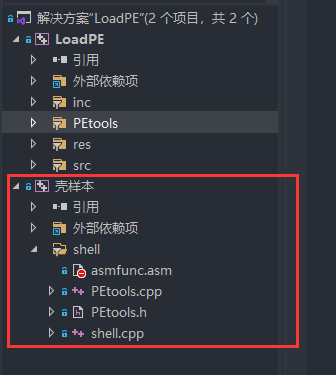

# 主界面

主界面便是查询当前所有进程，**点击对应进程的条目**便可以查询所有的模块

32位工具可以查看进程下所有32位模块，64位工具可以查看进程下所有64位模块

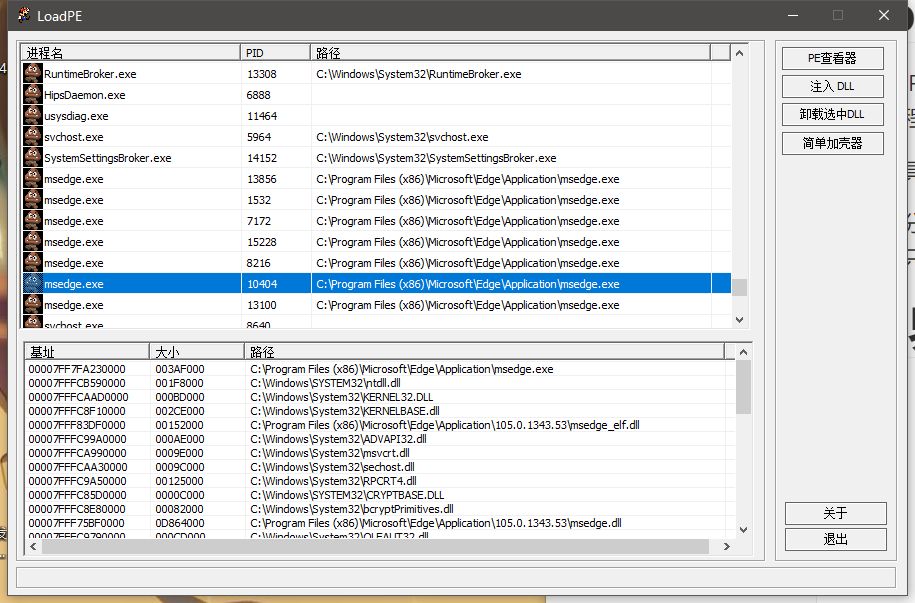

**实现原理**

主要使用的API：CreateToolhelp32Snapshot、EnumProcessModulesEx

使用这两个函数可以遍历进程、模块，然后使用GetModuleInformation、GetModuleFileNameEx等相关API查询信息

## 文件拖拽

对消息WM_DROPFILES进行捕获，MFC设置对应函数

当文件拖拽到主界面后会默认打开去打开 "PE查看器" 这个功能，这个功能会查看拖拽文件是否是可执行文件，如果是，则解析；如果不是，则提示不是PE文件

```c++
TCHAR szFilename[256]{ 0 };
DragQueryFile(hDropInfo, 0, szFilename, 254);
```

# PE查看器

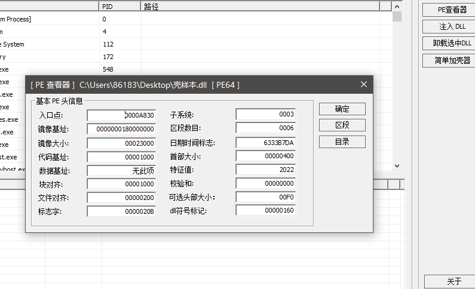

查看器主界面会显示出当前PE文件PE头和可选PE头的主要信息，其中**标题栏**上会显示当前正在分析的可执行程序的路径，如果是64位程序，会显示跟着显示PE64；

PE查看器主要使用了以前写的一个PEtools类（自己封装的，在此项目中作了一些修改）

**实现原理：**

在Windows上可以执行的程序被称为可执行文件，也可以被称为PE文件，它们都会以同一种格式去存放对应部分的数据；去按照这些个格式去解析便是此部分的实现原理。常见的PE文件有：exe，sys，dll

## PEtools类

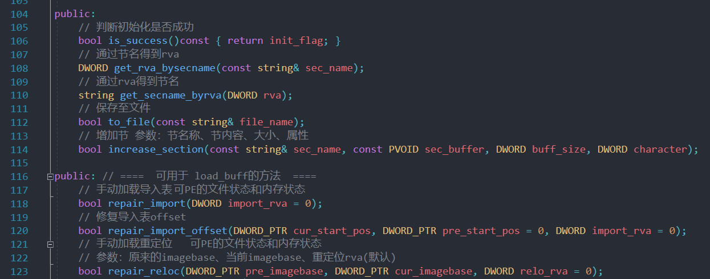

以上展示PEtools类的一些方法

另一个项目有更多的方法实现https://github.com/nicexiaobai123/PEtools.git，此项目只对32位程序操作，没有兼容64位

## 区段表

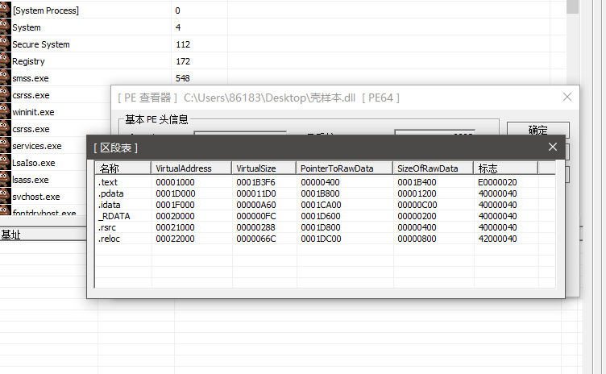

点击 "区段" 按钮，可以查看PE文件所有的区段信息和一些属性

## 目录表

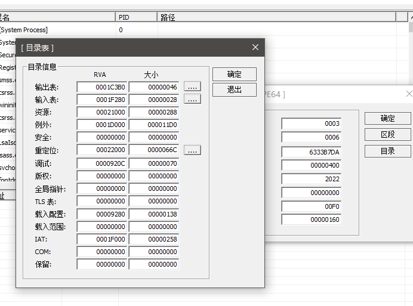

查看一些目录信息，其中可以查看三个关键的表的详细信息：导出表、导入表、重定位表

## 导出表

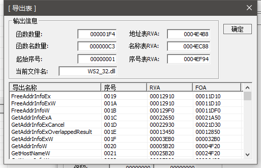


## 导入表

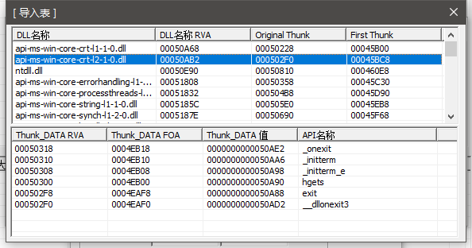


## 重定位表

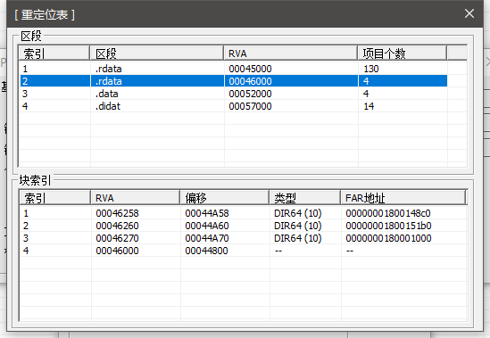

# 注入功能

选中对应进程，如果进程能够遍历到它的对应模块，那么代表当前进程有"被注入"的权限

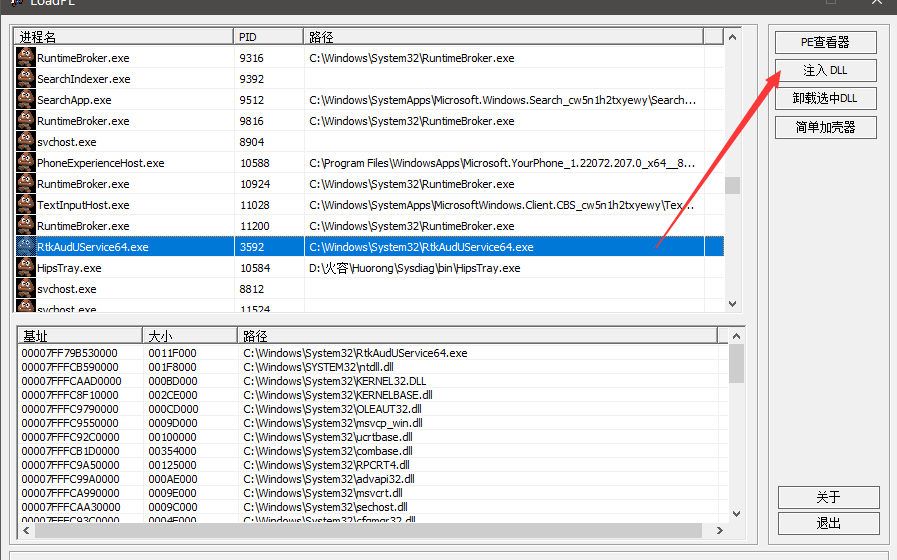

点击"注入DLL"按钮，会选着对应的dll文件，便注入进去了；同时也可以卸载自己注入的dll文件

这里需要用到MFC的一个CFileDialog类

# 简单加壳器

简单加壳器只是用来做示范用，只有加壳后的效果；壳代码就是弹出一个MessageBox

**当前项目中写了一个壳代码示范**

像upx壳有个压缩算法，可以加密和压缩PE文件；但简单加壳器并没有那些，只会将DLL弄进去，修改OEP到dll入口，修改导入表让查看人员混乱，同时也修改了重定位表

注意一点：64位程序加壳64位软件（壳代码也是64位），32位亦是如此

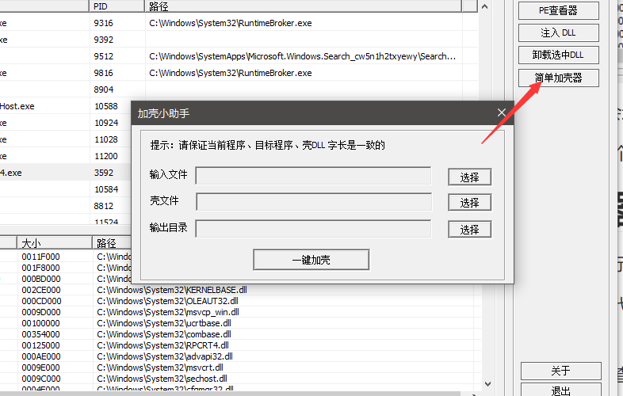
